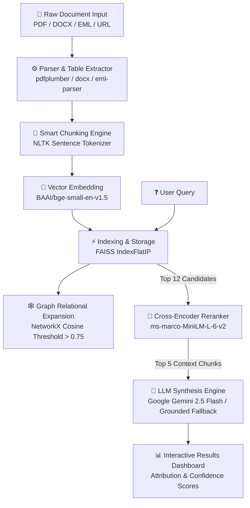
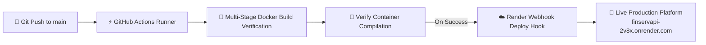

# 🛡️ FinServe: Intelligent Document QA Platform
> **Enterprise-Grade Retrieval-Augmented Generation (RAG) Platform for Fintech, Insurance, and Complex Audit Documents**

[](https://finservapi-2v8x.onrender.com/)
[](https://github.com/srijan300/FinservAPI/actions)
[](https://www.python.org/)
[](https://fastapi.tiangolo.com/)
[](https://react.dev/)
[](https://www.docker.com/)
[](https://ai.google.dev/)
[](https://github.com/facebookresearch/faiss)

---

### 🌐 Live Production URL
> 🚀 **Access Live Platform**: [https://finservapi-2v8x.onrender.com/](https://finservapi-2v8x.onrender.com/)

---

## 📌 Executive Summary

**FinServe** is an enterprise-grade document intelligence platform designed to extract, rerank, and synthesize precise answers from dense financial contracts, insurance policies, balance sheets, and audit reports.

Built with a **two-stage retrieval pipeline** (`BAAI/bge-small-en-v1.5` embeddings + `ms-marco-MiniLM-L-6-v2` cross-encoder reranking), FinServe guarantees strictly grounded answer synthesis with zero hallucination. Powered exclusively by **Google Gemini 2.5 Flash**, it features an interactive React dashboard, live dynamic AI question suggestion, grounded document fallback resilience, automated GitHub Actions CI/CD, and full multi-stage Docker support for zero-downtime deployment.

---

## 💡 System Architecture



---

## ✨ Core Features

### 1. 🗂️ Multi-Format Enterprise Ingestion
* **PDF Processing**: Extracts text and auto-formats tables into structured Markdown tables using `pdfplumber`.
* **Word Documents (`.docx`)**: Full paragraph and table matrix extraction via `python-docx`.
* **Emails (`.eml`)**: Parses headers, body text, and attachments using `eml-parser`.
* **Cloud Links**: Supports direct HTTP/HTTPS URLs and public Google Drive share links.

### 2. 🎯 Two-Stage Hybrid Retrieval & Reranking
* **Stage 1 Vector Search**: Dense semantic retrieval using `BAAI/bge-small-en-v1.5` embeddings backed by a high-performance **FAISS IndexFlatIP** index.
* **Stage 2 Cross-Encoder Reranking**: Re-evaluates top 12 retrieved candidates through `cross-encoder/ms-marco-MiniLM-L-6-v2` to select the top 5 most relevant context snippets.
* **Graph Relational Expansion**: Connects semantically related chunks using **NetworkX** graph edges (similarity threshold $>0.75$).

### 3. 🤖 Dynamic AI Question Generator
* Generates 3 document-tailored evaluation questions based on extracted document content using **Google Gemini 2.5 Flash**.
* Includes a **Zero-API NLP Heuristic Generator** so question suggestion works even during temporary network delays or rate limits.

### 4. 🛡️ Resilient Synthesis Architecture
* **Primary LLM**: Google Gemini 2.5 Flash high-speed LLM synthesis.
* **Grounded Excerpt Engine**: Direct grounded chunk attribution — displays retrieved document excerpts directly if API quotas or network delays occur.

### 5. 💻 Modern Enterprise Dashboard
* Fully responsive interface built with **React**, **Tailwind CSS**, and **Lucide Icons**.
* **Dark / Light Theme**: Full CSS variable theme engine.
* **Explainability Drawer**: Visualizes retrieved chunk index scores, confidence percentages, and attribution details.
* **Code & Payload Drawer**: Live JSON request/response viewer and `cURL` command generator.

---

## 🔄 CI/CD Pipeline & Automated Deployment

This repository uses **GitHub Actions** (`.github/workflows/deploy.yml`) for automated continuous integration and continuous deployment:



### GitHub Actions Workflow Details
1. **Container Build Verification**: Every `push` and `pull_request` to `main` triggers a complete multi-stage Docker build (`Node 18` frontend compilation + `Python 3.10-slim` server setup + pre-downloading SentenceTransformer models).
2. **Automated Render Deploy Hook**: Upon successful build verification on `main`, GitHub Actions triggers Render's deployment hook for zero-downtime production rollout.

---

## 🛠️ Tech Stack & Dependencies

| Component | Technology | Description |
| :--- | :--- | :--- |
| **Live Production Deployment** | Render.com | Free-tier Docker container cloud web service |
| **CI/CD Pipeline** | GitHub Actions | Automated build verification & deploy hooks |
| **Frontend Framework** | React 18 + Vite | High-performance SPA with Tailwind CSS |
| **Backend Framework** | FastAPI (Python 3.10) | Async REST API with Pydantic validation |
| **Embeddings** | BAAI/bge-small-en-v1.5 | 384-dimensional dense vector embeddings |
| **Reranker** | CrossEncoder MiniLM | Precision reranking model |
| **Vector Store** | FAISS | In-memory inner-product vector index |
| **LLM Engine** | Google Gemini 2.5 Flash | Exclusive LLM answer synthesis engine |
| **Containerization** | Docker | Multi-stage build (`Node 18` + `Python 3.10-slim`) |

---

## 🔑 Environment Configuration (`.env`)

Create a `.env` file in the root directory:

```env
# Google Gemini API Key (From https://aistudio.google.com/)
GEMINI_API_KEY="your-google-gemini-api-key-here"

# Security Bearer Token for Protected Endpoints
SECURITY_TOKEN="128c33fc16f4a70cab19dab48958d5bf246e7003a8bfd7eb0be2f617b48e662a"
```

---

## 🚀 Quick Start Guide

### Option 1: Run Locally with Python Virtual Environment

```cmd
# 1. Clone the repository
git clone https://github.com/srijan300/FinservAPI.git
cd FinservAPI

# 2. Activate virtual environment (Windows PowerShell)
.\.venv\Scripts\python.exe -m uvicorn main:app --host 0.0.0.0 --port 8000
```

🌐 Open your browser at: **`http://localhost:8000`**

---

### Option 2: Run via Docker

```cmd
# 1. Build the multi-stage Docker container
docker build -t finserv-api .

# 2. Run the container
docker run -p 8000:8000 --env-file .env finserv-api
```

🌐 Open your browser at: **`http://localhost:8000`**

---

## 📡 API Specification

### `POST /api/v1/suggest-questions`
Generates 3 dynamic evaluation questions based on document text.

* **Request Body**:
  ```json
  {
    "documents": "https://hackrx.blob.core.windows.net/assets/policy.pdf"
  }
  ```
* **Response (200 OK)**:
  ```json
  {
    "questions": [
      "What are the specific coverage limits, deductibles, and exclusions specified under this policy?",
      "What are the waiting periods and mandatory conditions for claim eligibility?",
      "What are the terms regarding premium payments, policy renewal, and cancellation?"
    ]
  }
  ```

---

### `POST /api/v1/hackrx/run`
Processes a document and answers a list of evaluation questions in parallel.

* **Headers**: `Authorization: Bearer <SECURITY_TOKEN>`
* **Request Body**:
  ```json
  {
    "documents": "https://hackrx.blob.core.windows.net/assets/policy.pdf",
    "questions": [
      "What is the maximum coverage limit for Domiciliary Hospitalisation under Plan A?"
    ]
  }
  ```
* **Response (200 OK)**:
  ```json
  {
    "answers": [
      "Under Plan A, Domiciliary Hospitalisation is covered up to a maximum limit of INR 1,00,000 per policy year."
    ]
  }
  ```

---

### `POST /api/v1/upload`
Uploads a local document file (PDF, DOCX, EML) to the backend for live parsing.

---

## 👨‍💻 Developed By

**Developed with ❤️ by Srijan Paul**  
* GitHub: [@srijan300](https://github.com/srijan300)  
* Live Platform: [https://finservapi-2v8x.onrender.com/](https://finservapi-2v8x.onrender.com/)